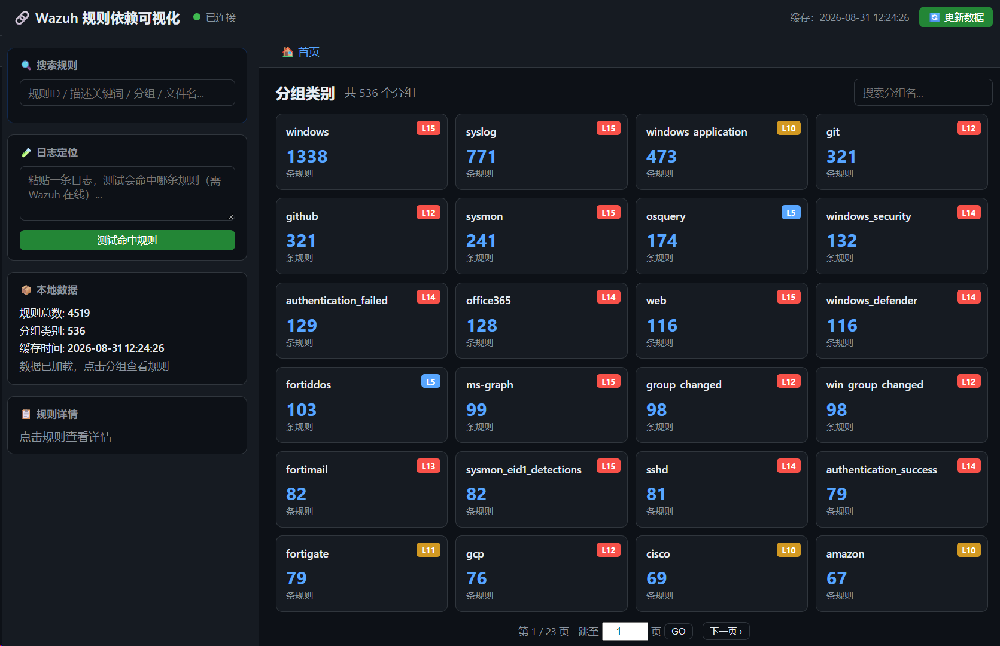
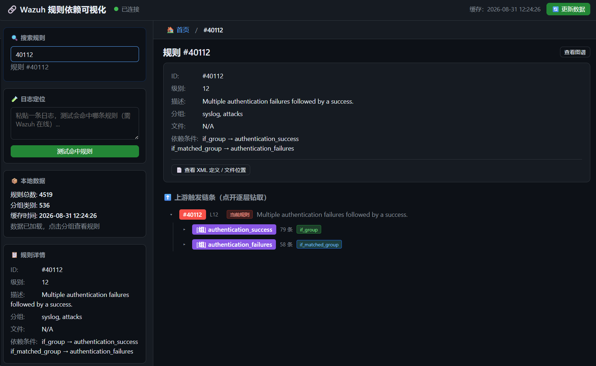
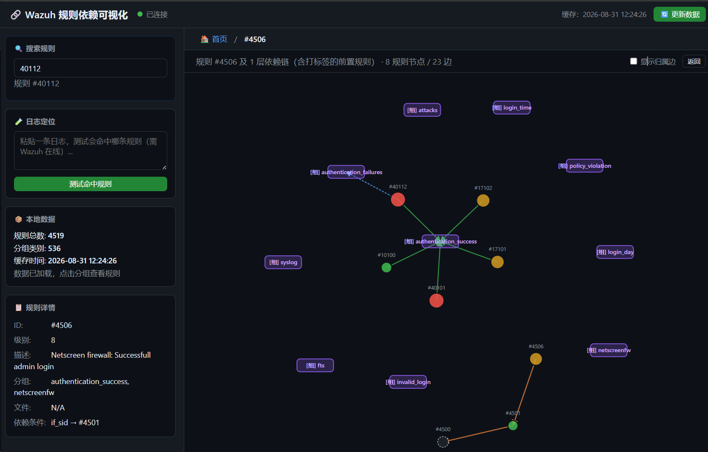

# Wazuh 规则依赖关系可视化工具

通过 Wazuh REST API 拉取规则，解析 `if_sid` / `if_group` / `if_matched_group` 等依赖关系，
用 **D3.js 力导向图** 可视化规则间的依赖链条，支持搜索高亮、完整路径追溯与日志匹配测试。

## 功能特性

- 📦 **全量数据本地缓存**：首次自动从 Wazuh 拉取全部规则并写入本地 `data/rules_cache.json`，之后所有读取优先走本地缓存（毫秒级返回）；点「更新数据」按钮才重新拉取并覆盖缓存
- 🏠 **首页只展示大类（找文件夹式）**：打开即显示分组类别总览（分组名 + 规则数 + 最高级别），点进分组才看该组规则列表，支持分页与跳转指定页，不一次性渲染全量图谱，避免卡顿
- 🔍 **搜索规则（核心入口）**：输入规则 ID / 描述关键词 / 分组 / 文件名，实时列出命中规则，点击进入该规则详情与依赖链
- 🧭 **依赖树逐层钻取**：在规则详情页点击节点逐层展开上下游依赖（懒加载），可追溯到完整触发链条
- 🗂️ **图谱视图**：按分组 / 关键词 / 规则为中心渲染受控子图，可切换是否显示规则归属边
- 🛡️ **受控渲染防卡顿**：单次图谱最多渲染 400 条规则节点，超限明确提示改用更小范围
- 📋 **规则详情**：级别、描述、分组、文件、if_sid / if_group / if_matched_group 依赖条件
- 📄 **查看规则 XML 定义**：查看某条规则在规则文件中的完整 XML 定义与文件位置，支持切换「单条规则 / 完整文件」，文件内容同样本地缓存，可按需刷新
- 🧪 **日志定位（logtest）**：侧边栏独立面板，粘贴一条日志实时测试命中哪条规则，点击直接跳转该规则依赖链
- ⚙️ 连接配置通过 `.env` 修改（`WAZUH_HOST` 等）

## 界面预览

**首页分组总览** 



**搜索规则**



**图谱视图**



## 环境要求

- **Wazuh Manager 4.x**：需提供 REST API（默认端口 `55000`）。部署方式无关 —— OVA 一体化镜像、Docker、rpm/deb 包安装、分布式集群（manager 节点）均可，只要 API 可达即可连接
- **API 账号**：使用 Wazuh 的 API 用户（非系统用户），且该账号需在 `api` 用户组中，具备读取规则的权限
- **网络**：运行本工具的机器需能访问 Wazuh 的 `55000` 端口（按需放行防火墙）
- **运行环境**：Python 3.8+（或使用 Docker）
- 已适配 Wazuh 4.10+/4.14 新版 API（单规则详情用 `q=id=` 查询过滤、logtest 用 `PUT /logtest` 及 `event`/`log_format`/`location` 参数），旧版本自动降级兼容

## 快速开始

### 1. 安装依赖

**推荐使用虚拟环境，避免污染系统 Python：**

```bash
# Windows (PowerShell)
python -m venv venv
venv\Scripts\activate
pip install -r requirements.txt

# Linux / macOS
python3 -m venv venv
source venv/bin/activate
pip install -r requirements.txt
```

> 不用虚拟环境、直接全局安装也可以：`pip install -r requirements.txt`（Windows 双击 `start.bat` 启动时会自动检查并安装缺失依赖）。

### 2. 配置环境变量

复制 `.env.example` 为 `.env`，修改 Wazuh 服务器信息：

```bash
copy .env.example .env      # Windows
# cp .env.example .env      # Linux / macOS
```

编辑 `.env`：

```
WAZUH_HOST=your-wazuh-host     # 改成你的 Wazuh 服务器地址
WAZUH_PORT=55000
WAZUH_USERNAME=wazuh
WAZUH_PASSWORD=wazuh
RULE_LIMIT=100              # 默认拉取条数；FETCH_ALL_RULES=True 则忽略此限制
FETCH_ALL_RULES=False
FLASK_PORT=5000
```

### 3. 测试 API 连接（可选）

```bash
python scripts/test_api.py --limit 10
```

### 4. 启动 Web 服务

**方式一：一键启动（推荐）**

直接双击项目根目录下的 `start.bat`：

- 自动检查 Python 依赖，缺失则自动安装
- 自动启动服务，并在 3 秒后自动打开默认浏览器
- 按 Ctrl+C 或关闭窗口即可停止服务

**方式二：命令行启动**

```bash
# 若使用虚拟环境，先激活（Linux/macOS）
source venv/bin/activate
# Windows: venv\Scripts\activate

python -m app.main
# 或
python scripts/run.py
```

### 5. 访问

浏览器打开 <http://localhost:5000>（一键启动会自动打开）

## 项目结构

```
wazuh-rule-visualizer/
├── README.md
├── requirements.txt
├── .env.example
├── LICENSE                   # MIT 许可证
├── config.py                 # 配置（读取环境变量）
├── app/
│   ├── main.py               # Flask 应用入口
│   ├── api/
│   │   ├── wazuh_client.py   # Wazuh API 客户端（认证/规则/logtest）
│   │   └── routes.py         # 后端 API 路由
│   ├── core/
│   │   ├── rule_parser.py    # 规则依赖解析（if_sid / if_group / ...）
│   │   └── graph_builder.py  # 图构建（节点 + 边）
│   └── static/
│       ├── index.html        # 前端主页面
│       ├── css/style.css
│       └── js/               # D3.js（本地化，离线可用）+ 应用逻辑
├── scripts/
│   ├── launcher.py           # 一键启动器（依赖检查/开浏览器/启动）
│   ├── run.py                # 命令行启动
│   ├── test_api.py           # API 连接测试
│   └── selftest.py           # 离线自检
├── start.bat                 # 双击一键启动（推荐，Windows）
├── Dockerfile                # Docker 镜像
└── docker-compose.yml        # Docker 部署（可选）
```

## API 接口

| 方法   | 路径                                                          | 说明                            |
| ---- | ----------------------------------------------------------- | ----------------------------- |
| GET  | `/api/status`                                               | 连接状态检查                        |
| GET  | `/api/config`                                               | 获取当前连接配置                      |
| POST | `/api/config`                                               | 动态修改连接配置并重连                   |
| GET  | `/api/overview`                                             | 分组大类总览（首页），优先读本地缓存            |
| POST | `/api/update`                                               | 重新全量拉取 Wazuh 规则并覆盖本地缓存        |
| GET  | `/api/rules?q=&group=&level_min=&level_max=&limit=&offset=` | 规则列表（查询结果），读缓存                |
| GET  | `/api/rule/<id>`                                            | 规则详情，读缓存                      |
| GET  | `/api/rule/<id>/xml`                                        | 单条规则的 XML 定义 + 文件位置（文件内容本地缓存） |
| GET  | `/api/rule/<id>/file`                                       | 规则所在文件的完整 XML（本地缓存）           |
| POST | `/api/rule/<id>/file/refresh`                               | 强制刷新该规则文件缓存                   |
| GET  | `/api/graph?rule_id=&depth=&groups=&q=`                     | 受控子图（依赖链 / 分组 / 关键词）          |
| POST | `/api/test`                                                 | logtest 日志匹配测试                |

## 数据缓存机制

- 规则缓存：`data/rules_cache.json`（首次自动生成，全量规则的精简解析结果）
- 规则文件缓存：`data/rule_files/*.xml.json`（首次查看某规则 XML 时自动生成该规则文件副本）
- 读取顺序：本地缓存 →（无缓存时）全量拉取 Wazuh 并落盘
- 更新：点击页面右上角「🔄 更新数据」→ 重新全量拉取 → 覆盖缓存；单个规则文件可在 XML 弹窗中单独刷新
- 首次全量拉取约 5~15 秒（取决于规则总量），之后所有接口毫秒级返回
- 缓存目录 `data/` 已在 `.gitignore` 中忽略，不会误提交任何本地数据

## 图节点与边说明

- **规则节点**：圆形，颜色按告警级别（≥12 红 / 8–11 橙 / 5–7 蓝 / ≤4 绿）
- **分组节点**：紫色圆角矩形（`group:<名称>`）
- **缺失节点**：虚线圆（引用了本次未拉取到的规则）
- **边类型**：
  - `if_sid`（橙色实线）：规则依赖另一条规则
  - `if_group`（绿色实线）：规则依赖某个分组
  - `if_matched_group`（蓝色虚线）：规则依赖日志匹配分组
  - `member`（灰色点线）：规则归属于某个分组

## 技术栈

- 后端：Python + Flask + requests
- 前端：D3.js v7（力导向图）
- API：Wazuh 4.x REST API

## Docker 部署（可选）

```bash
docker compose up -d
# 访问 http://localhost:5000
```

## 常见问题

- **加载图谱提示 500**：多为 `.env` 中 `WAZUH_HOST` 未改成真实服务器地址导致连接失败。修改后需重启服务（重新双击 `start.bat`）。
- **认证失败**：确认 Wazuh 用户是 API 用户，且账号在 `api` 用户组中；检查 host/port。
- **拉取大量规则较慢**：图渲染是前端力导向布局，几千条节点会较卡，建议先用 `RULE_LIMIT` 限制，或用搜索定位后再追溯路径。
- **新版 Wazuh（4.10+/4.14）兼容**：已适配 —— 单规则详情改用 `q=id=` 查询过滤（`/rules/{id}` 端点已移除）、logtest 改用 `PUT /logtest`（参数 `event`/`log_format`/`location`），旧版本自动降级兼容。
- **页面改动不生效**：前端静态文件更新后，浏览器需强制刷新（`Ctrl+F5`）。
